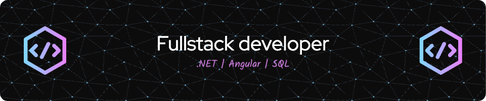

<h1 align="center">Hi 👋, I'm Manil Shah</h1>
<h3 align="center">Fullstack Developer | Turning Ideas into Dynamic Web Applications</h3>

  

<h3>About Me</h3>

I hold a Master’s degree in Computer Applications from Dharmsinh Desai University. Currently, I am enhancing my skills at eSparkBiz, a CMMI Level 3 company. With over a year of experience, I specialize in Fullstack development with a strong focus on .NET, Angular, SQL Server, and Node.js.

<b>My expertise includes:</b>
<ul>
  <li><b>Backend Development:</b> Proficient in C# and .NET for building scalable and efficient server-side applications.</li>
  <li><b>Database Management:</b> Experienced with SQL Server to design and manage robust database systems.</li>
  <li><b>Frontend Development:</b> Skilled in Angular for creating dynamic and responsive web interfaces.</li>
  <li><b>Fullstack Integration:</b> Combining frontend and backend technologies to deliver cohesive and high-performance web applications.</li>
</ul>

I’m passionate about leveraging cutting-edge technologies to turn innovative ideas into dynamic and functional web solutions.

- 💬 Ask me about **C#, .NET, Angular, SQL**

- 📫 Reach me at **manil.shah.dev@gmail.com**

<h3 align="left">Connect with me:</h3>

<h3 align="left">Languages and Tools:</h3>

 
   
   
   
   
   

  

